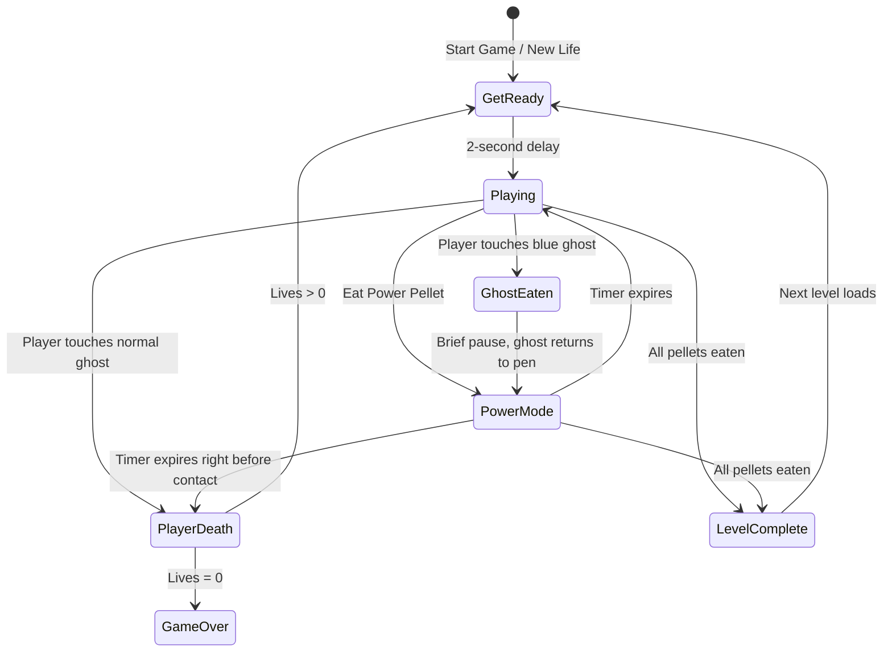
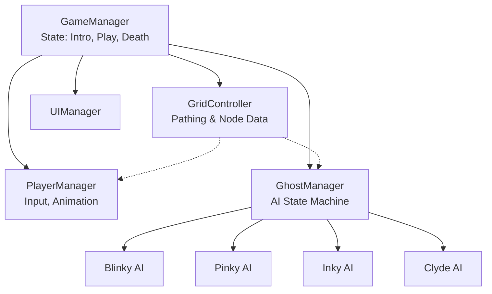

# Game Design Document — *Pacman*

| | |
|---|---|
| **Working title** | Pacman |
| **Team** | Yael Moshkovich |
| **Genre** | 2D Arcade |
| **Target platform** | PC (Windows) + Android mobile build |
| **Engine / Unity version** | Unity 6 (6000.3.20f1.) |
| **Orientation & reference resolution** | Portrait, 1080 × 1440 reference |
| **Expected session length** | 2 – 10 minutes |
| **Document version** | v0.1 — 2026-09-09 |

---

## 1. High Concept

The player navigates a character through an enclosed grid-based maze, eating all pellets while avoiding four distinct ghosts. Eating large power pellets temporarily renders ghosts vulnerable, allowing the player to consume them for bonus points. Clearing all pellets advances the level. Touch a standard ghost, lose a life.

### Design pillars

1. **Deterministic Ghost Logic** — Ghosts do not use random pathfinding. Each has a specific, hardcoded targeting behavior (e.g., direct chase, ambush, patrol). The player's deaths are always the result of poor routing, never unfair RNG.
2. **Strict Grid Alignment** — Movement is locked to a grid. The player and ghosts only make 90-degree turns at designated intersections, ensuring precise near-misses and clean visual readability over fluid physics.
3. **Aggressive Input Buffering** — The game prioritizes the player's *intent*. If a turn input is pressed slightly before an intersection, the game buffers it and executes the turn perfectly on the frame the character aligns with the grid. 

---

## 2. Reference & Inspiration

- **Primary reference:** ** (1980, Namco). 
  - **Taking:** Grid layout, wrap-around tunnels, specific ghost personality AI (Chase, Intercept, Flank, Random-ish), power pellet phase. 
  - **Not taking:** The arcade-specific hardware limitations, exact level layouts, or the kill-screen bug.
- **Video:** [Classic Pacman Gameplay] — Specifically observing the cornering speed and ghost pacing.

---

## 3. Core Game Loop

**Moment-to-moment rules**:
- Entities move continuously at a set speed; they cannot stop moving unless blocked by a wall.
- **Cornering:** If the player buffers a turn, their character takes the corner slightly faster than a ghost taking the same corner, allowing the player to gain distance through high-input pathing.
- **Scoring:** Standard pellets grant 10 points. Power pellets grant 50. Eaten ghosts grant 200, doubling for each consecutive ghost eaten during a single power phase (200, 400, 800, 1600).
- **Failure:** Touching a ghost in 'Chase' or 'Scatter' mode stops gameplay immediately, plays a death animation, resets entities to starting positions, and subtracts one life.

### Parameters you will need to tune

| Parameter | What it controls | First guess |
|---|---|---|
| `playerSpeed` | Base movement speed of the player in units/sec | 5.0 |
| `ghostSpeed` | Base movement speed of ghosts (slightly slower than player) | 4.75 |
| `frightenedDuration` | How many seconds ghosts remain blue | 6.0 |
| `frightenedSpeedMultiplier`| How much slower blue ghosts move | 0.6x |
| `levelSpeedRamp` | Percentage increase to all entity speeds per level clear | 5% |

**Where these live:** A `GameSettings` ScriptableObject, allowing designers to balance the difficulty curve without touching code.

**Feel target:** A new player should easily clear the first maze. By maze 3, the ghost speed and shortened power-pellet duration should consistently overwhelm casual players.

---

## 4. Controls & Input

| Action | Keyboard | Gamepad |
|---|---|---|
| Move Up | W / Up Arrow | D-Pad Up / Left Stick Up |
| Move Down | S / Down Arrow | D-Pad Down / Left Stick Down |
| Move Left | A / Left Arrow | D-Pad Left / Left Stick Left |
| Move Right | D / Right Arrow | D-Pad Right / Left Stick Right |
| Pause / Start | Escape / Enter | Start |

- Input is read on **press** and stored in an `inputBuffer` variable for up to 0.5 seconds.
- The `MovementController` checks `inputBuffer` every frame. If the buffered direction is legally traversable based on the current grid tile, the entity snaps to the center axis of the new direction and executes the turn.
- If a menu is open (e.g., Pause), movement input is ignored.

---

## 5. Screens & UI

1. **Title Screen** — Game logo, "Press Start to Play", high score display, and a simulated AI game running in the background.
2. **Main Gameplay HUD** — 
   - Top Left: Current Score (1UP).
   - Top Right: High Score.
   - Bottom Left: Lives remaining (represented by player icons).
   - Bottom Right: Current Level (represented by fruit icons).
3. **Game Over Screen** — Dimmed gameplay background, "GAME OVER" text, final score, "Press Start to Restart" prompt (with a 1.5-second input lockout to prevent accidental skips).

- **Canvas setup:** Screen Space – Overlay, CanvasScaler *Scale With Screen Size*, reference 1080 × 1440, Match Width or Height = 0.5.

---

## 6. Art & Audio

| Asset | Variants / frames | Source & licence | Use |
|---|---|---|---|
| `spr_Player` | 4 directions × 3 animation frames | Kenney.nl / Custom, CC0 | Main character |
| `spr_Ghost` | 4 colors × 4 directions + Blue + Eyes | Kenney.nl / Custom, CC0 | Enemies |
| `spr_Tileset` | 16-piece neon border set | Custom, CC0 | Maze walls |
| `sfx_Waka` | 2 alternating pitched loops | FreeSound.org, CC0 | Eating pellets |
| `sfx_GhostSiren`| 1 seamless drone loop | FreeSound.org, CC0 | Ambient gameplay tension |

**Licence note:** All assets will be sourced from public domain (CC0) repositories or created in-house for this prototype. No copyrighted Namco assets will be used in the build.

**Technical art rules:** Point (no filter) texture import, PPU 16, grid snapping enabled. Sorting layers: Background → Grid/Walls → Pellets/Items → Ghosts → Player → UI.

---

## 7. Technical Design

**Scenes:** `Boot.unity` (handles initialization and persistent singletons) → `Main.unity` (contains UI and gameplay; resets via state manager, not scene reloading).

**Packages / systems used:** Input System, custom Grid Node system (No Unity Physics/Rigidbodies).

**Architecture:**

| Script | Responsibility |
|---|---|
| `GridNode` | Stores coordinates, neighboring valid nodes, and if it contains a pellet. |
| `GhostBrain` | Abstract class; evaluates target nodes and selects the next intersection turn. |
| `MovementGridSnap` | Interpolates entity transforms cleanly between `GridNode` centers. |
| `GameSettings` | ScriptableObject holding speeds, timings, and point values. |

### The course features you are implementing

1. **Object Pool** — standard pellets and floating score text, because instantiating 240+ items on level load causes GC spikes that cost frames, and a dropped frame in a grid-aligned timing game results in unfair deaths.
2. **Coroutines** — power pellet duration, start-of-level "Ready!" delays, and death sequences: time-based events with a clear start and end, rather than messy timer variables checked every frame in Update.
3. **Singleton** — the GameManager and UIManager, via a generic base class, so a ghost touching the player can immediately trigger the death state and update UI lives without needing references manually threaded through the inspector.
4. **Mobile build** — Android touch controls (four-way directional swipe detection), tested on a physical phone
5. **ScriptableObjects** — GameSettings for balancing values (base speeds, frightened duration, level ramping) as assets, so tweaking difficulty doesn't require editing component fields or recompiling scripts.

## 8. Scope

### 8.1 MVP — the game is not a game without these

- [ ] A fully traversable, single-screen grid with no dead ends.
- [ ] Player movement that snaps to intersections.
- [ ] Consumable pellets that increase a score counter.
- [ ] One ghost that actively chases the player's current grid position.
- [ ] Win state (eat all pellets) and Lose state (touch the ghost).

### 8.2 Polish — if the MVP is done and playable

- [ ] 4 distinct ghost AI behaviors (Direct chase, predict next tile, flank, radial distance check).
- [ ] Power pellets, frightened ghost states, and score multipliers for consecutive ghost eats.
- [ ] Wrap-around tunnels on the left and right sides of the screen.
- [ ] Progressive difficulty ramping upon level reset.

### 8.3 Explicitly out of scope — we are **not** building these

- Multiple unique maze layouts (will reuse one master layout and simply ramp the speed).
- Multiplayer, co-op, or online leaderboards.
- Unity Physics/Rigidbodies (all collision will be calculated via grid node distance).

---

## Changelog

| Version | Date | Change |
|---|---|---|
| v0.1 | 2026-09-09 | Initial GDD generated. |
