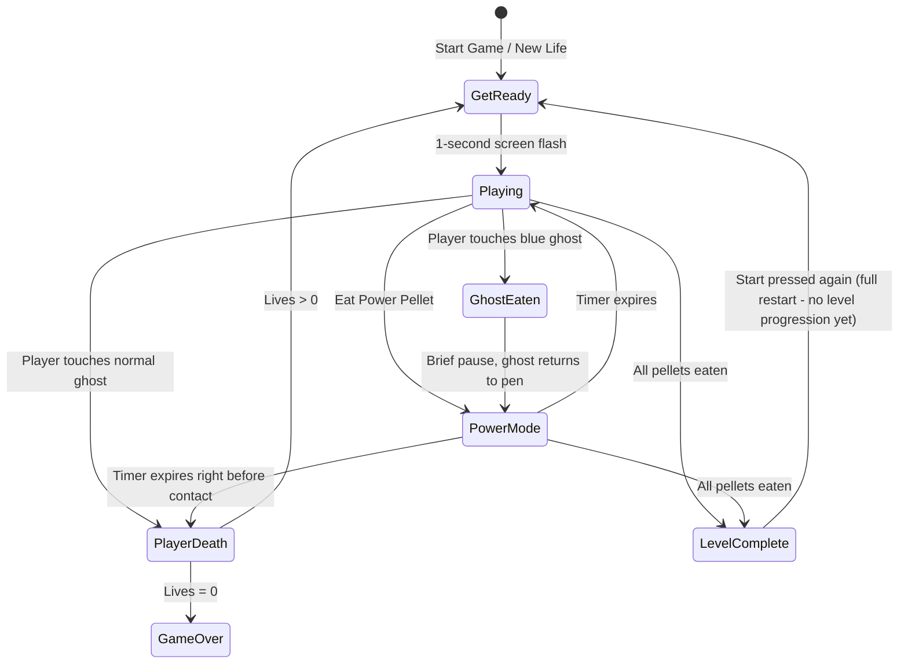
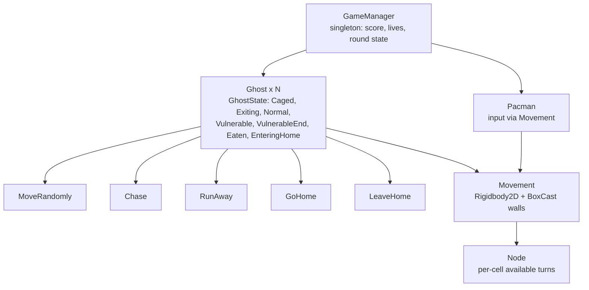

# Game Design Document — *Pacman*

| | |
|---|---|
| **Working title** | Pacman |
| **Team** | Yael Moshkovich |
| **Genre** | 2D Arcade |
| **Target platform** | PC (Windows) |
| **Engine / Unity version** | Unity 6 (6000.3.20f1.) |
| **Orientation & reference resolution** | Portrait, 1080 × 1440 reference |
| **Expected session length** | 2 – 10 minutes |
| **Document version** | v0.2 — 2026-10-03 |

---

## 1. High Concept

The player navigates a character through an enclosed grid-based maze, eating all pellets while avoiding several ghosts (visually distinct, behaviorally identical). Eating large power pellets temporarily renders ghosts vulnerable, allowing the player to consume them for bonus points. Clearing all pellets wins the round. Touch a non-vulnerable ghost, lose a life.

### Design pillars

1. **Deterministic Ghost Logic** — Ghosts alternate between a hardcoded direct-chase behavior and a flee behavior, both targeting Pac-Man's actual position; between those phases they wander using random turn choices at intersections. Captures are always the result of being caught during a chase phase, never unfair RNG.
2. **Strict Grid Alignment** — Movement is locked to a grid. The player and ghosts only make 90-degree turns at designated intersections, ensuring precise near-misses and clean visual readability over fluid physics.
3. **Aggressive Input Buffering** — The game prioritizes the player's *intent*. If a turn input is pressed slightly before an intersection, the game buffers it and executes the turn perfectly on the frame the character aligns with the grid. 

---

## 2. Reference & Inspiration

- **Primary reference:** ** (1980, Namco). 
  - **Taking:** Grid layout, wrap-around tunnels, specific ghost personality AI (Chase, Intercept, Flank, Random-ish), power pellet phase. 
  - **Not taking:** The arcade-specific hardware limitations, exact level layouts, or the kill-screen bug.
- **Video:** [Classic Pacman Gameplay] — Specifically observing the cornering speed and ghost pacing.

---

## 3. Core Game Loop

```mermaid
stateDiagram-v2
    [*] --> GetReady: Start Game / New Life
    GetReady --> Playing: 1-second screen flash
    Playing --> PowerMode: Eat Power Pellet
    PowerMode --> Playing: Timer expires
    Playing --> GhostEaten: Player touches blue ghost
    GhostEaten --> PowerMode: Brief pause, ghost returns to pen
    Playing --> PlayerDeath: Player touches normal ghost
    PowerMode --> PlayerDeath: Timer expires right before contact
    PlayerDeath --> GetReady: Lives > 0
    PlayerDeath --> GameOver: Lives = 0
    Playing --> LevelComplete: All pellets eaten
    PowerMode --> LevelComplete: All pellets eaten
    LevelComplete --> GetReady: Start pressed again (full restart - no level progression yet)
```

**Moment-to-moment rules**:
- Entities move continuously at a set speed; they cannot stop moving unless blocked by a wall.
- **Cornering:** If the player buffers a turn, their character takes the corner slightly faster than a ghost taking the same corner, allowing the player to gain distance through high-input pathing.
- **Scoring:** Pellets and power pellets each grant their own configured point value. Eaten ghosts grant a flat 200 points each — no consecutive-eat multiplier implemented.
- **Failure:** Touching a ghost that isn't currently vulnerable stops gameplay immediately, flashes the screen black briefly, resets all entities (including caged/eaten ghosts) to starting positions, and subtracts one life.

### Parameters you will need to tune

| Parameter | What it controls | First guess |
|---|---|---|
| `playerSpeed` | Base movement speed of the player in units/sec | 5.0 |
| `ghostSpeed` | Base movement speed of ghosts (slightly slower than player) | 4.75 |
| `frightenedDuration` | How many seconds ghosts remain blue | 6.0 |
| `frightenedSpeedMultiplier`| How much slower blue ghosts move | 0.6x |
| `levelSpeedRamp` | Percentage increase to all entity speeds per level clear | 5% |

**Where these live:** Public fields directly on the relevant `MonoBehaviour`s (e.g. `Movement.speed`, `Ghost.vulnerableEndDuration`, `GhostBehavior.duration`), tuned per-instance in the Inspector — no `GameSettings` ScriptableObject.

**Feel target:** A new player should easily clear the first maze. By maze 3, the ghost speed and shortened power-pellet duration should consistently overwhelm casual players.

---

## 4. Controls & Input

| Action | Keyboard |
|---|---|
| Move Up | W / Up Arrow |
| Move Down | S / Down Arrow |
| Move Left | A / Left Arrow |
| Move Right | D / Right Arrow |
| Start game | Space (or click the Start button) |

- Input is read every frame and buffered in `Pacman.bufferedMoveDirection` so a turn pressed slightly early still executes.
- `Movement.changeMovementDirection` checks whether the buffered direction is legally traversable; if so, the entity's direction snaps to it on the current grid cell.
- No pause feature is implemented. No gamepad support is implemented.

---

## 5. Screens & UI

1. **Title Screen** — A Start button (also triggerable with Space); pellets, Pac-Man, and ghosts stay hidden until pressed.
2. **Main Gameplay HUD** — Plain text displays for current Score and Lives remaining. No high score, no icons, no level counter.
3. **End Screen** — A shared text element reading "GAME OVER" (red) on a loss or "YOU WIN!" (green) on clearing all pellets, with the Start button reappearing immediately to begin a new game.

- **Canvas setup:** Screen Space – Overlay, CanvasScaler *Scale With Screen Size*, reference 1080 × 1440, Match Width or Height = 0.5.

---

## 6. Art & Audio

| Asset | Variants / frames | Source & licence | Use |
|---|---|---|---|
| `spr_Player` | 4 directions × 3 animation frames | Kenney.nl / Custom, CC0 | Main character |
| `spr_Ghost` | 4 colors × 4 directions + Blue + Eyes | Kenney.nl / Custom, CC0 | Enemies |
| `spr_Tileset` | 16-piece neon border set | Custom, CC0 | Maze walls |

**Licence note:** All assets will be sourced from public domain (CC0) repositories or created in-house for this prototype. No copyrighted Namco assets will be used in the build.

**Technical art rules:** Point (no filter) texture import, PPU 16, grid snapping enabled. Sorting layers: Background → Grid/Walls → Pellets/Items → Ghosts → Player → UI.

---

## 7. Technical Design

**Scenes:** A single scene, `Pacman.unity`, containing everything; rounds reset via `GameManager` state, not scene reloading.

**Packages / systems used:** Input System, `Physics2D` (`Rigidbody2D` + `BoxCast`-based grid movement/collision), 2D Tilemap (also used to auto-instantiate `Node`/`Pellet` GameObjects per painted tile).

**Architecture:**

```mermaid
graph TD
    GM[GameManager<br/>singleton: score, lives, round state] --> P[Pacman<br/>input via Movement]
    GM --> G[Ghost x N<br/>GhostState: Caged, Exiting, Normal,<br/>Vulnerable, VulnerableEnd, Eaten, EnteringHome]
    G --> MR[MoveRandomly]
    G --> CH[Chase]
    G --> RA[RunAway]
    G --> GH[GoHome]
    G --> LH[LeaveHome]
    P --> MV[Movement<br/>Rigidbody2D + BoxCast walls]
    G --> MV
    MV --> N[Node<br/>per-cell available turns]
```

| Script | Responsibility |
|---|---|
| `Node` | Per-cell trigger; reports which of the 4 directions are currently open for a given collision layer mask. |
| `GhostBehavior` | Abstract base for all ghost behaviors; handles the enable/disable timer cycle and applies the chosen direction at each `Node`. |
| `Chase` / `RunAway` / `GoHome` / `LeaveHome` | Concrete behaviors that pick a direction by comparing distance to a target (Pac-Man, `homeNode`, or `exitNode`). |
| `Movement` | `Rigidbody2D`-based grid movement; blocks movement via `Physics2D.BoxCast` against a per-state collision layer mask. |

### The course features you are implementing

1. **Physics** — `Rigidbody2D` + `Physics2D.BoxCast` drive all grid movement and wall-collision checks (`Movement`, `Node`), so turning and blocking stay consistent without hand-rolled collision math.
2. **Instantiation** — `Node` and `Pellet` GameObjects are auto-instantiated per painted Tilemap tile at runtime, and each `Ghost` is a prefab instance, so the maze layout and pellet/path placement come from painting tiles rather than manually placing objects.
3. **Coroutines** — the power-pellet vulnerable-ghost timer (`Ghost.runVulnerablePhase`) and the death-screen flash (`GameManager.flashDeathScreenThenContinue`): time-based events with a clear start and end, rather than chaining `Invoke` calls by method name.
4. **Singleton** — `GameManager.Instance`, so a ghost touching the player can immediately trigger the death state and update score/lives without needing references manually threaded through the inspector.

## 8. Scope

### 8.1 MVP — the game is not a game without these

- [x] A fully traversable, single-screen grid with no dead ends.
- [x] Player movement that snaps to intersections.
- [x] Consumable pellets that increase a score counter.
- [x] Ghosts that actively chase the player's current grid position.
- [x] Win state (eat all pellets) and Lose state (touch a non-vulnerable ghost).

### 8.2 Polish — if the MVP is done and playable

- [x] Ghost AI behaviors (random wander, direct chase, flee) — shared logic across all ghosts, not 4 unique personalities; ghosts are only visually distinct.
- [x] Power pellets and frightened ghost states. (No score multiplier for consecutive eats — flat points per ghost.)
- [x] Wrap-around tunnels (`Teleporter`).
- [ ] Progressive difficulty ramping upon level reset.

### 8.3 Explicitly out of scope — we are **not** building these

- Multiple unique maze layouts (reuses one master layout).
- Multiplayer, co-op, or online leaderboards.
- Mobile build, sound, ScriptableObject-based settings, object pooling.

---

## Changelog

| Version | Date | Change |
|---|---|---|
| v0.1 | 2026-09-09 | Initial GDD generated. |
| v0.2 | 2026-10-03 | Updated to match the actual implementation |
